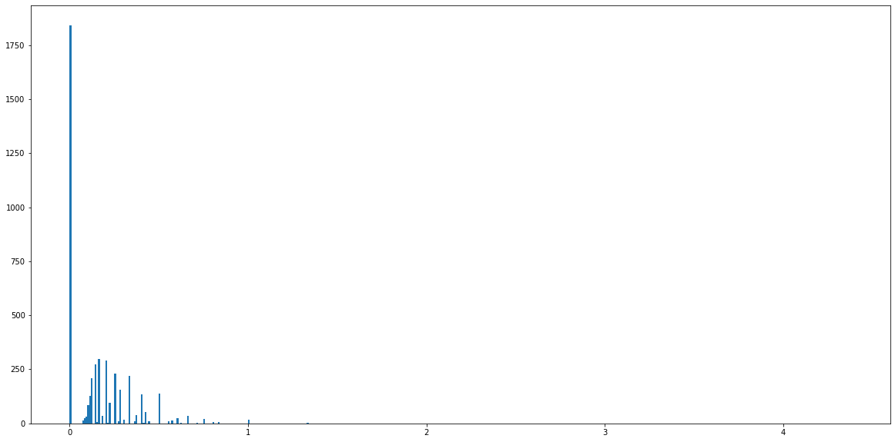

==================================================
Indicate: Transliterate Indic Languages to English
==================================================

Transliterations to/from Indian languages are still generally low quality. One problem is access to data. Another is that there is no standard  transliteration.
For Hindi--English, we build novel dataset for names using the ESPNcricinfo. For instance, see `here <https://www.espncricinfo.com/hindi/series/pakistan-tour-of-england-2021-1239529/england-vs-pakistan-1st-odi-1239537/full-scorecard>`__ for hindi version of the `english scorecard <https://www.espncricinfo.com/series/pakistan-tour-of-england-2021-1239529/england-vs-pakistan-1st-odi-1239537/full-scorecard>`__.
We also create a dataset from `election affidavits <https://affidavit.eci.gov.in/CandidateCustomFilter>`__
We also exploit the `Google Dakshina dataset <https://github.com/google-research-datasets/dakshina>`__.

To overcome the fact that there isn't one standard way of transliteration, we provide k-best transliterations.

Install
-------
We strongly recommend installing `indicate` inside a Python virtual environment
(see `venv documentation <https://docs.python.org/3/library/venv.html#creating-virtual-environments>`__)

::

    pip install indicate

General API
-----------
1. transliterate.hindi2english will take Hindi text and translate into English.

Examples
--------
::

  from indicate import transliterate
  english_translated = transliterate.hindi2english("हिंदी")
  print(english_translated)

output -
hindi

Functions
----------
We expose 1 functions, which will take Hindi text and translates into English.

- **transliterate.hindi2english(input)**

  - What it does:

    - Converts given hindi text into English language

  - Output

    - Returns text in English Language

Data
----
The dataset used to train the model.

- `Indian Election affidavits <https://affidavit.eci.gov.in/CandidateCustomFilter>`__

- `Google Dakshina dataset <https://github.com/google-research-datasets/dakshina>`__

- `ESPN Cric Info <https://www.espncricinfo.com/hindi/series/pakistan-tour-of-england-2021-1239529/england-vs-pakistan-1st-odi-1239537/full-scorecard>`__ for hindi version of the `english scorecard <https://www.espncricinfo.com/series/pakistan-tour-of-england-2021-1239529/england-vs-pakistan-1st-odi-1239537/full-scorecard>`__.

Evaluation
----------
Model was evaluated on test dataset of Google Dakshina dataset, Model predicted 45.87% exact matches.
Below is the edit distance metrics on test dataset (0.0 mean exact match, the farther away from 0.0,
the difference is more between predicted text and actual text)

Authors
-------

Rajashekar Chintalapati and Gaurav Sood

Contributor Code of Conduct
---------------------------------

The project welcomes contributions from everyone! In fact, it depends on
it. To maintain this welcoming atmosphere, and to collaborate in a fun
and productive way, we expect contributors to the project to abide by
the `Contributor Code of
Conduct <http://contributor-covenant.org/version/1/0/0/>`__.

License
----------

The package is released under the `MIT
License <https://opensource.org/licenses/MIT>`__.
